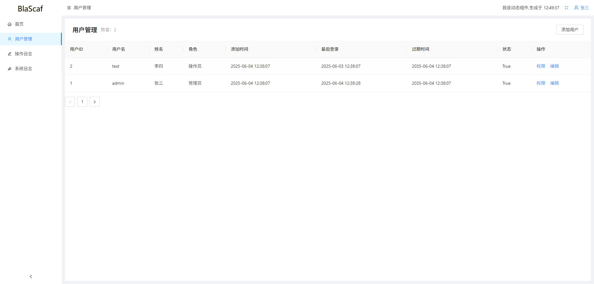

# BlaScaf

**一个基于 .NET 8 + Blazor Server + Ant Design 的中后台系统脚手架**

A Blazor Server scaffold for admin systems — authentication, role-based menus, user management, audit logs and a database console, out of the box.

    

---

## 项目简介

BlaScaf 是一个后台系统**类库**（输出 DLL，不是可执行程序），把中后台系统里重复建设的部分——登录认证、角色权限、用户管理、菜单导航、日志审计、数据库运维——做成了现成的底座。

它的工作方式是"**框架做底座，宿主做业务**"：

- 你的系统是一个独立的 Web 宿主项目，引用 `BlaScaf` 后调用 `AddBsService()` / `UseBsService()` 两个方法完成接入；
- 系统名、角色、菜单树、用户、日志持久化等所有个性化内容，都通过一个静态配置类 `BsConfig` 以声明式方式注入；
- 业务页面写在宿主项目里，路由由框架自动发现，登录、布局、菜单、权限校验全部复用框架能力。

不改框架源码，就能搭出一套完整的信息化系统；多个系统还可以共用同一套框架底座。

---

## 界面预览



---

## 核心能力

### 🔐 认证与会话

- Cookie 登录认证，登录口令经前端 MD5 + 一次性 DES 加密传输
- 登录状态保活（KeepAlive）与定时复核，断线重连容忍
- 单用户单会话：同一账号新登录后，旧会话在数十秒内自动失效
- 可配置密码有效期（`ChangePwdDays`），到期强制修改密码
- 可选验证码扩展：只对指定角色启用，验证码组件由宿主注入（`CaptchaFragment` + `CaptchaRoles`）

### 🧑‍💼 用户与权限

- 角色 + 菜单双驱动的权限体系：菜单决定"能不能看见"，路由校验决定"能不能访问"，二者共用同一份角色配置
- 内置用户管理页：新增 / 编辑 / 禁用 / 分页查询，密码强度校验（大小写 + 数字 + 长度）
- 用户编辑抽屉可追加自定义扩展字段（`UserEditorFields`），直接绑定 `BsUser` 的扩展属性，支持文本、整数、布尔、多选四种控件
- "权限"按钮扩展点（`UserAuthFragment`）：可为用户管理页挂上自定义授权弹窗，如菜单授权、数据范围授权

### 📝 日志审计

- 系统日志（登录成功 / 失败、异常事件）与操作日志（用户操作、数据变更、SQL 执行）双轨记录
- 内置分页查询页面，持久化方式由宿主通过委托注入，与业务数据库解耦

### 🗄️ 数据库管理页

一个面向运维的数据库控制台（`/dbadmin`，基于 FreeSql）：

- 浏览真实库表结构与实体映射关系
- 表数据在线查看、新增、编辑、删除
- 建表、删表、加字段、改字段名、删字段，支持先生成 DDL 预览再执行
- 原生 SQL 控制台，执行记录写入操作日志
- 可通过 `DbAdminEntityTypes` 限定可见实体范围

### 🧩 扩展点

- 顶部导航栏扩展插槽（`HeaderFragments`）：环境标签、公告、快捷按钮等
- `<head>` 原始 HTML 注入（`HeadInjectRawHtmls`）：引入外部脚本
- 浏览器标题自动跟随当前页面切换，规则可自定义（`SetBrowserTitle`）
- 隐藏路由（`RouterLinkPages`）与匿名页面（`AnonymousPages`）：不出现在菜单但可访问 / 无需登录

### 🚀 部署形态

- 常规模式：管理端部署在站点根目录
- **子目录模式**（`PathBase`）：管理端挂到 `/sub/*` 子目录，根目录留给 Vue3 等前台静态站点（`/` 自动返回 `wwwroot/index.html`），并可通过 `RootApiPrefixes` 放行根级 WebAPI 前缀——**前后台共用同一个站点进程，切换部署形态只改一行配置，页面代码零改动**

---

## 内置页面

| 路由 | 页面 | 说明 |
| --- | --- | --- |
| `/login` | 登录页 | 含验证码扩展插槽 |
| `/users` | 用户管理 | 含扩展字段、权限弹窗扩展点 |
| `/optlogs` | 操作日志 | 分页查询 |
| `/syslogs` | 系统日志 | 分页查询 |
| `/dbadmin` | 数据库管理 | 结构浏览 / 数据维护 / SQL 控制台 |

内置页面同样受菜单权限管控：宿主在 `MenuItems` 或 `RouterLinkPages` 中登记后才会放开访问。

---

## 快速开始

### 运行演示项目

```bash
git clone https://github.com/rq204/BlaScaf.git
cd BlaScaf
dotnet run --project DemoApp
```

打开控制台输出的地址，使用内置演示账号登录：

| 账号 | 密码 | 角色 |
| --- | --- | --- |
| `admin` | `admin` | 管理员（全部功能） |
| `test` | `Test1234` | 审计员（受角色权限限制的对照示例） |

演示项目包含：菜单配置、用户初始化、日志落库、顶部扩展、数据库管理接入、子目录访问模式配置等完整用法。

### 接入到自己的系统

1. 创建一个 Web 项目，引用 `BlaScaf`；
2. 在 `Program.cs` 中完成 `BsConfig` 初始化并接入框架；
3. 编写业务页面，登记到菜单即可运行。

最简接入示意（完整可运行版本见 `DemoApp/Program.cs`）：

```csharp
using BlaScaf;
using FreeSql;

BsConfig.AppName = "我的新系统";
BsConfig.CookieTimeOutMinutes = 30;
BsConfig.Roles = new List<string> { "管理员", "普通用户" };
BsConfig.MenuItems = new List<BsMenuItem>
{
    new BsMenuItem { Key = "home", Title = "首页", Icon = "home", RouterLink = "/", Roles = new List<string> { "管理员", "普通用户" } },
    new BsMenuItem { Key = "users", Title = "用户管理", Icon = "user", RouterLink = "/users", Roles = new List<string> { "管理员" } }
};

var builder = WebApplication.CreateBuilder(args);

var fsql = new FreeSqlBuilder()
    .UseConnectionString(DataType.Sqlite, "Data Source=myapp.db")
    .UseAutoSyncStructure(true)
    .Build();

Startup.InitFreeSqlActionFunc(fsql);   // 一行接好用户、日志的默认持久化实现
BsConfig.Users = fsql.Select<BsUser>().ToList();
Startup.CheckBsConfig();

builder.Services.AddSingleton<IFreeSql>(fsql);
builder.Services.AddBsService();

var app = builder.Build();
app.UseBsService();
app.Run();
```

---

## 工作机制

用 BlaScaf 开发系统，理解三点即可上手：

1. **一切配置围绕 `BsConfig`**：菜单、角色、用户缓存、各类持久化委托都在这里声明式注入，`Startup.CheckBsConfig()` 会在启动时校验必填项；
2. **页面权限 = 登录态 + 菜单/隐藏路由 + 角色**：新页面只要声明 `@page` 并登记到 `MenuItems` 或 `RouterLinkPages`，权限校验、布局、菜单全部自动生效；
3. **用户缓存与数据库双写**：`BsConfig.Users` 是认证的运行时缓存，任何影响登录态的用户变更（改密码、禁用、Token 刷新）都要同时更新它。

---

## 项目结构

```
BlaScaf/
├── BlaScaf/          # 框架类库（本项目的核心产出）
├── DemoApp/          # 演示宿主项目，也是接入写法的参考实现
├── BlaScaf.png       # 界面截图
└── LICENSE           # MIT
```

---

## 应用场景

- 企业后台管理系统
- 数据展示与分析平台
- 内部信息管理系统（ERP、CRM、OA 等）
- 管理端 + 前台静态站点同进程部署的混合形态系统
- 任意基于权限驱动的中后台系统

---

## 依赖环境

- .NET 8 SDK
- 界面组件：[AntDesign Blazor](https://antblazor.com/) 1.6.0
- ORM：[FreeSql](https://github.com/dotnetcore/FreeSql) 3.5.206（示例与数据库管理页基于 FreeSql，支持 SQLite / SQL Server / MySQL / PostgreSQL 等常见数据库；业务侧不强制使用）
- 浏览器：现代桌面浏览器（Blazor Server 模式，无需 WASM 支持）

---

## 文档

完整的接入契约与开发规范见 **[BlaScaf AI 开发使用手册](BlaScaf/README.md)**——即使不阅读框架源码，仅凭该手册也能完成一个新系统的搭建，适合开发者和 AI 辅助开发场景。

---

## 许可证

[MIT](LICENSE)
